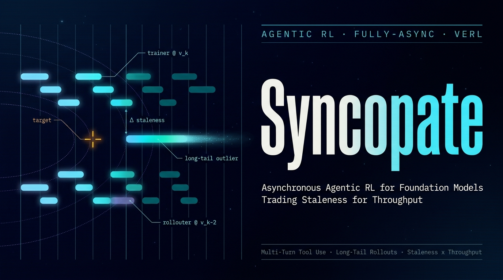

<!-- PROJECT LOGO -->
<div align="center">
  <a href="https://github.com/ChaoyuWang04/Async-AgenticRL">
    
  </a>

<h3 align="center">Syncopate</h3>

<p align="center">
  A hands-on, apples-to-apples comparison of verl's synchronous colocate and fully-async RL training on the same multi-turn agentic task — quantifying when (and whether) asynchronous rollout pays off under long-tail trajectory distributions.
  <br /><br />
  | <a href="">🤗 HuggingFace</a> |
  <a href="https://github.com/ChaoyuWang04/AdCampaignAgent-SFT/issues/new?labels=bug&template=bug-report---.md">Report Bug</a> |
  <a href="https://github.com/ChaoyuWang04/AdCampaignAgent-SFT/issues/new?labels=enhancement&template=feature-request---.md">Request Feature</a> |
</p>

</div>

## About

Syncopate is an experimental study of **asynchronous agentic RL training** built on [verl](https://github.com/volcengine/verl) — named after syncopation, the musical art of placing beats *off* the grid: fully-async training does to the rigid batch cadence exactly what syncopation does to a metronome. It runs the same multi-turn tool-calling task under two training architectures and compares them mechanism by mechanism:

- **Synchronous colocate** — training and rollout share GPUs; every batch waits for its slowest trajectory
- **fully_async_policy** — trainer and rollouter are decoupled; rollout streams continuously against a slightly stale policy

The project is organized around three prior judgments that the experiments are designed to verify or falsify:

1. **The fundamental tension of synchronous RL is batch barrier × long tail.** Per-step rollout time is ≈ max(tᵢ) in sync mode versus ≈ mean(tᵢ) with async streaming, and the gap is determined by the tail of the trajectory-length distribution — which is naturally heavy in agentic workloads.
2. **Fully-async trades data staleness for throughput.** Rollouts are generated by a policy 1–k versions behind the trainer; parameter-sync frequency is the core knob between on-policy fidelity and throughput.
3. **At small scale (4 GPUs), the speedup may well be ≤ 1×.** That is not a failure — quantifying *where the crossover point lies* (scale × tail severity) is itself the deliverable.

Key mechanisms under study: **staleness**, **parameter-sync frequency**, **partial rollout**, and **trainer/rollouter resource ratio**.

The full plan lives in [docs/plan_2_verl_agentic_async.md](docs/plan_2_verl_agentic_async.md).

Sister project to [Darkroom](https://github.com/ChaoyuWang04/Darkroom_VeRL-Omni): that one studies RL infra under *heterogeneous* rollouts (diffusion pipelines), this one under *long-tail* rollouts — together they cover the two frontier tensions of RL post-training systems.

## Experiment Matrix

| Experiment | Variable | What to observe |
|---|---|---|
| E1 | Synchronous colocate baseline | Control group: reward curve, per-step time breakdown, rollout-length P50 vs P99 |
| E2 | Async, default sync frequency | Throughput vs E1; reward degradation, if any |
| E3 | Async, sync frequency 2–4× sparser | How training quality decays as staleness grows |
| E4 | Async, partial rollout on/off | Tail elimination vs off-policy cost |
| E5 (optional) | 3+1 vs 2+2 trainer/rollouter split | Sensitivity of throughput bottleneck to resource ratio |

Unified metrics: end-to-end samples/sec, wall-clock to reach the same reward level, and per-trajectory staleness (policy-version gap) distribution.

## Hardware Path

| Stage | Hardware | Model |
|---|---|---|
| Smoke test | Local 1×RTX 5090 32GB (sm_120) | Qwen2.5-1.5B-Instruct, GSM8K + tool calling |
| Sync baseline & async comparison | Cloud 4×RTX 5090 | Qwen2.5-7B-Instruct + LoRA, multi-turn search agent |
| Scale re-test (optional) | Cloud 8×RTX 5090 | Same task, crossover-point validation |

## Repository Layout

```text
Syncopate/
├── docs/                    # project plan and experiment notes
├── src/                     # task definition, reward, data modules (framework-agnostic)
├── tests/                   # tests
├── models/                  # local checkpoints (gitignored)
└── reference/               # industrial post-training reference project (gitignored, not redistributable)
```

The `reference/` directory holds a production-grade verl AgentLoop post-training release used as a design reference (agent runtime, verifier, loss masking, GRPO wiring). It is copyrighted third-party material and is **not** included in this repository.

## Setup

```sh
git clone https://github.com/ChaoyuWang04/Async-AgenticRL.git
cd Async-AgenticRL
```

Environment setup scripts (verl + sglang/vllm on sm_120) will land together with Phase 0 code.

## Roadmap

- [ ] **Phase 0 — Single-GPU smoke test**: colocate GRPO with tool_agent_loop on local 5090; verify sm_120 stack; map the sync-mode dataflow
- [ ] **Phase 1 — Multi-GPU sync baseline**: 7B + LoRA multi-turn search task on 4×5090; measure rollout long-tail distribution and GPU idle attribution
- [ ] **Phase 2 — fully_async_policy comparison**: run E1–E5; write the async-payoff verdict for this scale and tail shape
- [ ] **Phase 3 — Stress & depth (optional)**: ALFWorld long-horizon tail, Megatron backend, 8-GPU re-test, VLM agentic
- [ ] **Phase 4 — slime escape hatch / framework comparison**: port the framework-agnostic task modules to slime; contrast HybridFlow vs native pass-through design philosophies
- [ ] Publish comparison blog post + long-tail/throughput dataset
- [ ] Upload artifacts to HuggingFace

## Contributing

Issues and pull requests are welcome. The highest-leverage areas:
- additional agentic tasks with heavier long-tail rollout distributions
- better staleness / throughput instrumentation
- reproduction on different hardware scales to refine the crossover-point estimate

## Links

- Project: [https://github.com/ChaoyuWang04/Async-AgenticRL](https://github.com/ChaoyuWang04/Async-AgenticRL)
- HuggingFace:
- Author: [Chaoyu Wang](https://www.linkedin.com/in/samwang04/)

## License

Distributed under the MIT License. See `LICENSE` for more information.
